# Audio ML Homework 3
**Authors:**\
[Roman Pavlosiuk](https://github.com/gllekkoff)\
[Iryna Denysova](https://github.com/Shnapa)

## Task

The goal of this work is to build a Ukrainian speech recognition system by fine-tuning a pretrained Whisper model on the Toronto Ukrainian Speech Dataset. The model is trained on a subset of speakers and evaluated on a fixed held-out set of 21 speakers that are never seen during training or validation. Performance is measured using Word Error Rate (WER) and Character Error Rate (CER).

---

## Model Choice

We use **`openai/whisper-base`** - a 74M parameter multilingual encoder-decoder transformer pretrained by OpenAI on 680,000 hours of multilingual speech. Whisper was chosen because it natively supports Ukrainian and comes with a strong multilingual acoustic understanding out of the box, meaning fine-tuning can focus on adapting to the specific speaker and recording conditions of this dataset rather than learning Ukrainian from scratch.

`whisper-base` was preferred over `whisper-small` (244M parameters) due to the 8 GB VRAM constraint of the training hardware (NVIDIA RTX 4060). The base model comfortably fits with a batch size of 8, leaving enough headroom for mixed-precision training and gradient accumulation.

---

## Dataset

The Toronto Ukrainian Speech Dataset consists of audio recordings of Ukrainian speech with corresponding transcripts. The data is organized by speaker folders, and the following 21 folders are reserved exclusively for final testing:

```
toronto_27, toronto_46, toronto_42, toronto_37, toronto_89, toronto_43,
toronto_157, toronto_9, toronto_156, toronto_7, toronto_123, toronto_54,
toronto_67, toronto_62, toronto_81, toronto_134, toronto_148, toronto_21,
toronto_135, toronto_166, toronto_58
```

The remaining speakers are split 90/10 into train and validation sets.

### Exploratory Data Analysis

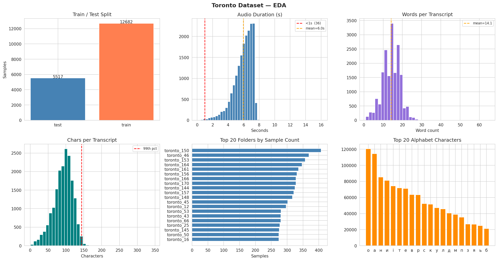

The dataset contains approximately 29,000 valid samples after filtering out missing files and empty transcripts. The train/test split is heavily skewed toward training, which is expected given only 21 test folders out of the full set.

Audio durations are mostly in the 3–10 second range, which fits naturally within Whisper's 30-second input window. A small number of clips are under 1 second - these are problematic for Whisper since the model struggles with very short audio segments. Clips longer than 30 seconds are hard-truncated at input, as Whisper's encoder accepts exactly 3000 mel frames.

The transcript length analysis shows a mean of around 14 words per utterance with most samples falling in the 5–25 word range. The vocabulary is rich with approximately 18,000 unique word forms - typical for Ukrainian, which is a highly inflected language where the same root word appears in many morphological forms.

The folder imbalance plot reveals uneven speaker representation, with some speakers contributing significantly more samples than others. This is worth noting as it may cause the model to be better calibrated toward higher-frequency speakers.

### Sample Audio

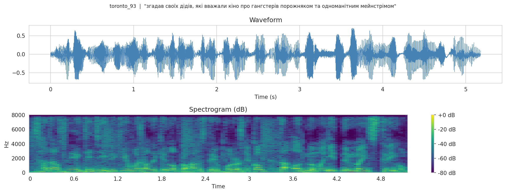

A representative sample waveform and spectrogram are shown above. The spectrogram shows clear speech formant structure across the frequency range, indicating good recording quality with minimal background noise.

### Duration vs. Transcript Length

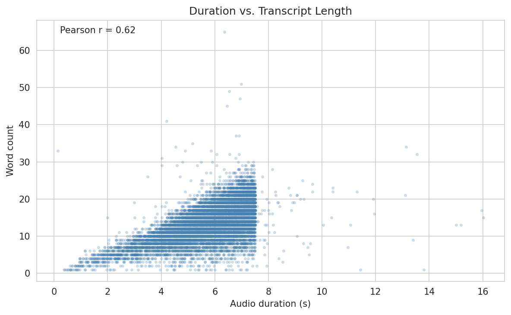

The correlation between audio duration and word count gives an idea of how consistent the speaking rate is across the dataset. A Pearson r close to 1 would indicate clean, consistent speech. Lower values suggest variability in speaking speed or some misalignment between audio and transcript.

### Token Length Analysis

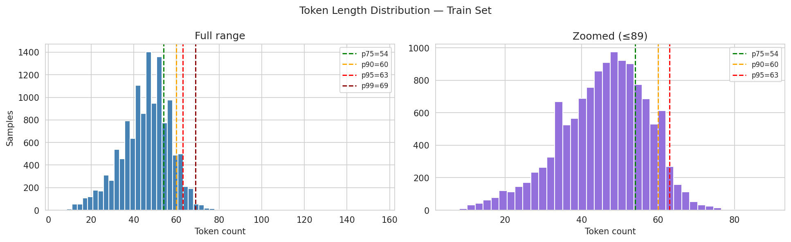

A key optimization was deriving `MAX_NEW_TOKENS` directly from the data rather than using Whisper's default of 448. Ukrainian Cyrillic text averages **3.26 tokens per word** with Whisper's BPE tokenizer - significantly higher than Latin-script languages because the tokenizer was trained predominantly on Latin text and splits Cyrillic words into more subword pieces.

By tokenizing all training transcripts and computing percentiles, we found that 99% of transcripts contain at most **69 tokens**. Setting `MAX_NEW_TOKENS = 69` (the p99 value, computed dynamically at runtime) reduces the maximum decoder steps from 448 to 69 - a 6x reduction in decoder work during both validation and inference.

---

## Training

### Setup

Training is implemented using **PyTorch Lightning**, which handles the training loop, checkpointing, and early stopping. The model is optimized with AdamW using a linear warmup over the first 10% of training steps followed by linear decay to zero. This schedule prevents large gradient updates early in fine-tuning when the decoder is still poorly calibrated.

| Parameter | Value |
|-----------|-------|
| Model | `openai/whisper-base` |
| Precision | `bf16-mixed` |
| Batch size | 8 |
| Gradient accumulation | 4 (effective batch = 32) |
| Learning rate | 1e-5 |
| LR schedule | Linear warmup (10%) + linear decay |
| Weight decay | 0.1 |
| Optimizer | AdamW |
| Max epochs | 20 (early stopping, patience=2) |
| Early stopping monitor | `val_wer` |
| Gradient clipping | 1.0 |

### Key Engineering Decisions

**Mixed precision (bf16):** We use `bf16-mixed` precision rather than `fp16`. The RTX 4060 (Ada Lovelace architecture) has native bf16 Tensor Core support, and bf16 is more numerically stable than fp16 for training - it has the same dynamic range as float32, just with less mantissa precision.

**Validation on WER, not loss:** The checkpoint and early stopping both monitor `val_wer` rather than validation loss. Loss is a proxy for transcription quality; WER measures it directly. A model can have lower loss but worse WER if it becomes overconfident on common tokens. By optimizing WER directly, the saved checkpoint is the one that actually transcribes best.

**`MAX_TOKENS` from data:** As described in the EDA section, capping the decoder at 69 tokens instead of 448 significantly reduces validation and inference time without dropping any transcripts - 99% of samples fall within this limit.

**`torch.compile`:** The model is compiled with `torch.compile(dynamic=True)` before training. This JIT-compiles the model into optimized CUDA kernels, giving approximately 15–20% faster forward passes after the initial compilation cost on the first epoch.

**Tensor Core utilization:** `torch.set_float32_matmul_precision("high")` is set to allow PyTorch to use Tensor Cores for float32 matrix multiplications, improving throughput on the RTX 4060.

---

## Results

> *To be filled in after training completes.*

| Metric | Value |
|--------|-------|
| Test WER | - |
| Test CER | - |
| Best epoch | - |

### Sample Predictions

```
REF : ...
PRED: ...
```

## Automatic Speech Translation (AST) with Whisper

### Overview

This project implements a system for Automatic Speech Translation (AST).

The goal is to convert:
- English speech (audio) → Ukrainian text (translation)

This task is complex because it combines:
- Speech recognition (audio → text)
- Machine translation (text → another language)

### Dataset

We use the Google FLEURS dataset, which provides:
- audio samples
- original transcriptions
- translated text

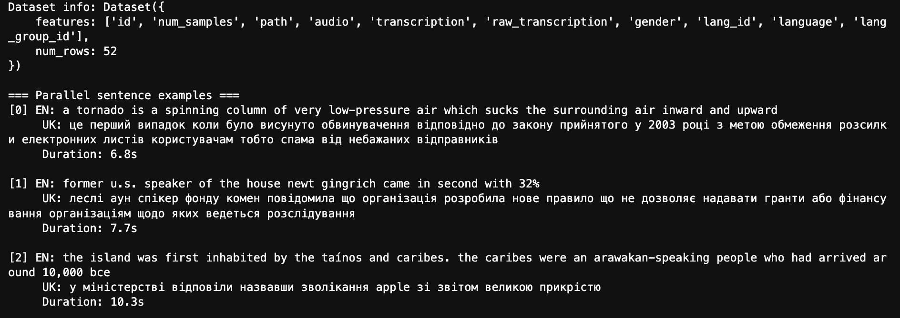

#### What this shows
Each sample contains:
- `audio` — input speech  
- `transcription` — original English text  
- `translation` — Ukrainian translation  

#### Important
The dataset is very small:
- ~130 training samples  
- ~60 validation samples  
- ~60 test samples  

This strongly limits model performance.

### Dataset Split

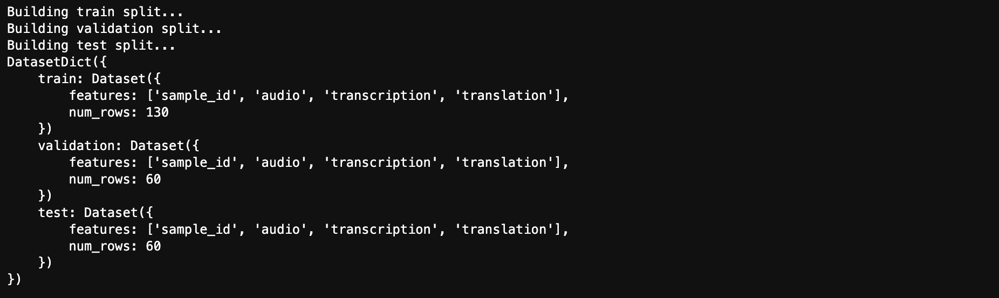

The split is correct, but total data is too small for effective training.

### Dataloader

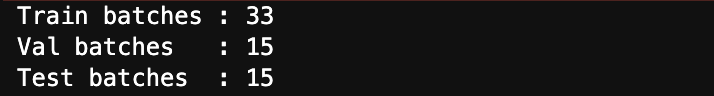

- Pipeline works correctly  
- But number of batches is small, so learning is limited  

## Audio Representation

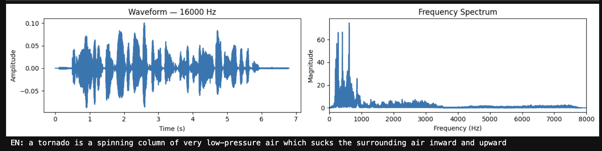

#### What this shows
- Waveform (signal over time)  
- Frequency spectrum  

Audio is converted into features before model processing.  
This part works correctly and does not cause issues.

### Model

We use the pretrained Whisper model:
- ~37.8M parameters  
- multilingual support  

The model is large, but the dataset is small, so adaptation is weak.

### Training Process

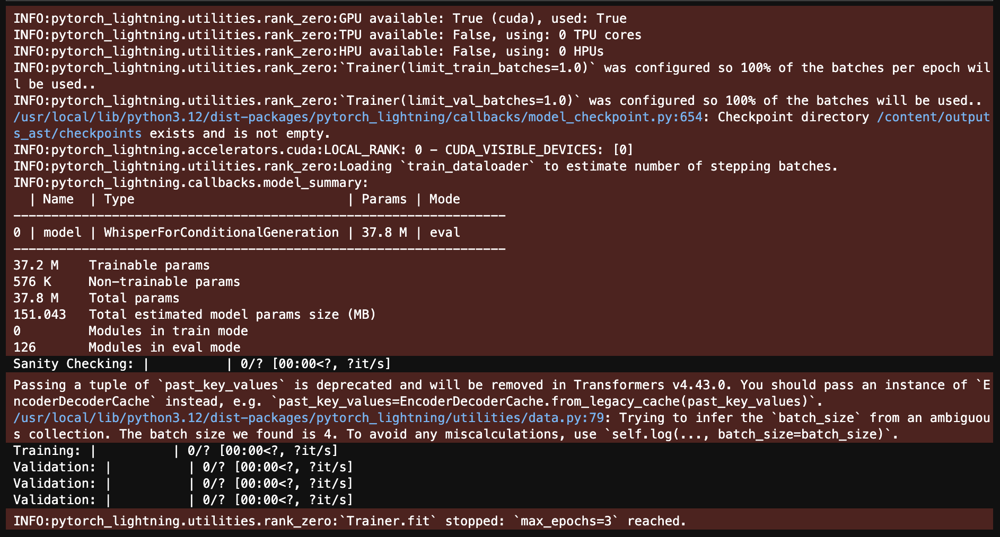

#### Critical observation
Training: 0/?
Validation: 0/?

This indicates:
- training loop is limited or not fully effective  
- model did not properly iterate over the dataset  

The pipeline runs, but real learning is minimal.

### Baseline Predictions


Predictions before training (zero-shot).
- outputs are often incorrect or meaningless  
- model is not adapted to this dataset  

### Evaluation (COMET)

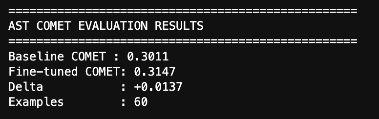

- small improvement after training  
- model learned slightly, but not enough  

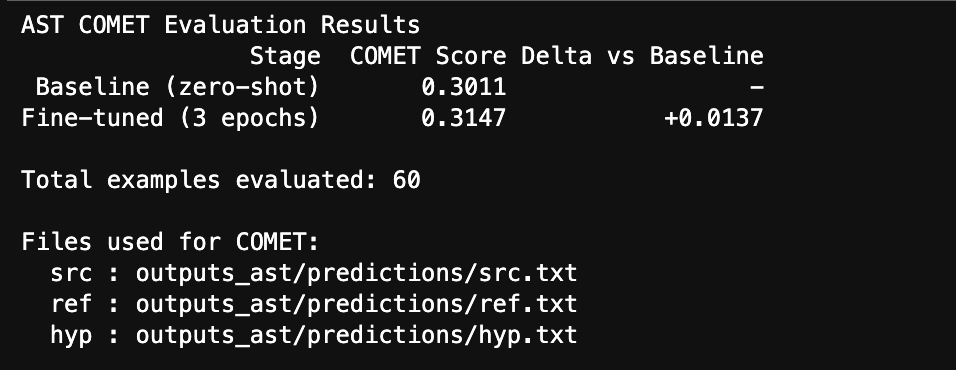

- evaluation is correct (60 samples)  
- improvement is confirmed  
- results are still weak  

### Sample Predictions

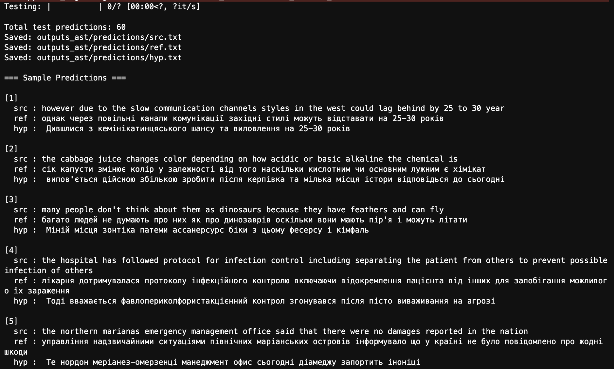

- `src` — English input  
- `ref` — correct Ukrainian translation  
- `hyp` — model prediction  

So
- reference translations are correct  
- predictions are often:
  - incorrect  
  - unrelated  
  - grammatically broken  

The model failed to learn proper translation.

---

### Why Results Are Weak

#### 1. Small dataset
- only ~130 training samples  
- not enough for deep learning  

#### 2. Few training epochs
- only 3 epochs  
- insufficient training time  

#### 3. Large model vs small data
- 37M parameters  
- cannot generalize from small dataset  

#### 4. Training inefficiency
- logs show weak iteration (`0/?`)  

#### 5. Task complexity
- AST combines speech recognition and translation  
- harder than single-task problems  

---

### Conclusion

The project successfully builds a full AST pipeline:
- data loading  
- preprocessing  
- model training  
- evaluation  

However:
- training is limited  
- improvement is small  
- predictions are mostly incorrect  

### Key Takeaway
The pipeline works correctly, but due to the very small dataset and limited training process, the model could not significantly improve translation quality.
